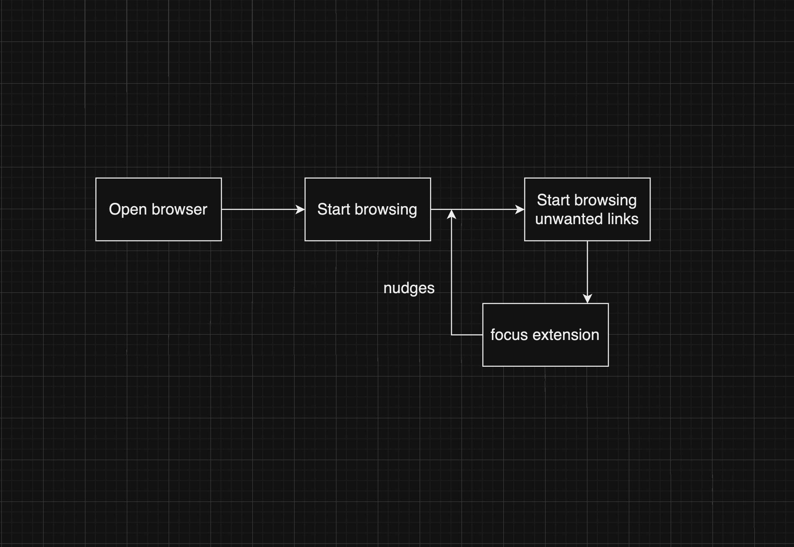

# What is a control system?

There are open systems which are y = f(x).

You can control the input x and observe the output y.

For e.g., 

press a button -> light turns on

There are closed systems which are y = f(x, u).

You can control the input x and the control u and observe the output y.

The control u is a function of the output y and the input x.

To give an example, consider a thermostat. The input is the temperature of the room. The output is the desired temperature of the room. The control is the heater. The control is a function of the output and the input. If the temperature of the room is less than the desired temperature, the heater is turned on. If the temperature of the room is greater than the desired temperature, the heater is turned off.

turn on -> thermotat adjusts the heater -> temperature of the room changes

The temperature of the room is the output. The desired temperature is the input. The heater is the control.

This app is a controller for yourself.

There are control systems out there, that want your engagement/attention as output and design systems to maximize this engagement.

We need a control system to control our engagement/attention.

# Why do we need control systems?

We need control systems to control the output of a system.

Our outputs are being converted to dissipated energy. We want to minimize this dissipated energy, maximize the output, or both.

This project is more of an experiment than really an answer.

I also run https://focus.app which is an open system to help you focus.

This is a closed system to help you focus.

# Overview 

# Links

[System and Revolution](https://www.amazon.com/System-Revolution-V-Shiva-Ayyadurai-ebook/dp/B01ECJLKL2/ref=tmm_kin_swatch_0)