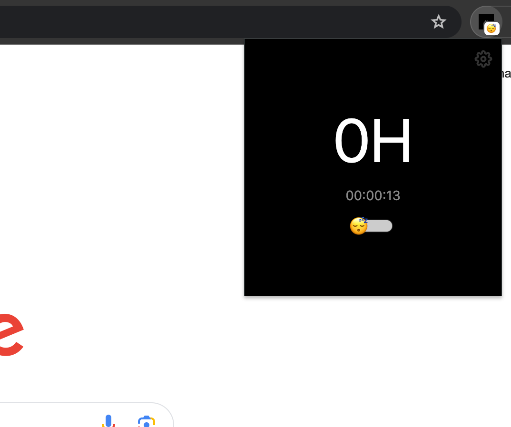
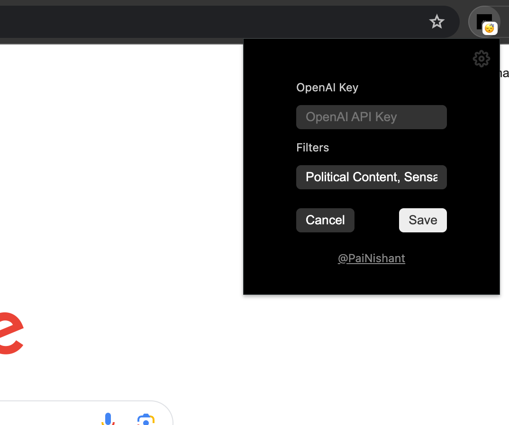
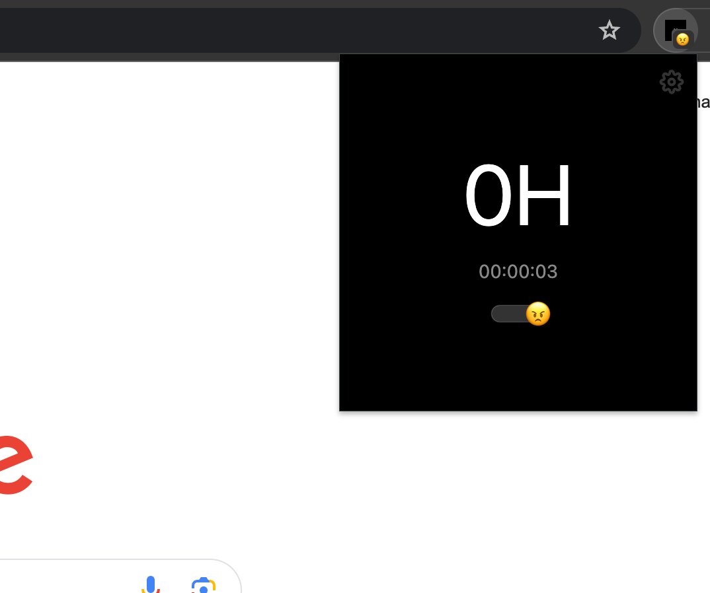
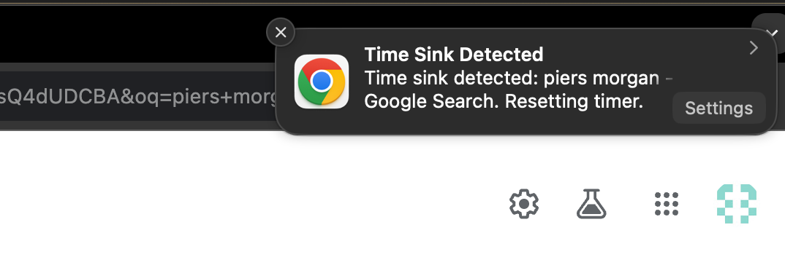

# Overview 

# Installation

1. Download the latest build from releases.
2. Unzip the file.
3. Go to chrome://extensions
4. Enable developer mode.
5. Click on load unpacked.
6. Select the unzipped folder.
7. Pin the extension.
8. Click on the extension icon.

Done.

# How to use?

1. Click on the extension icon.
2. Click on settings on the top right.
3. Paste your openai api key.
4. Click on save.

I've already some filters I personally want to use. You can add your own filters.

# How does it work?

I designed this extension as a game.

The goal of the game is to focus on the task at hand.

If you spend 1 hour without falling for any of the filters, you get 1 point. That is what the 0H in bold means in the screenshots.

You get to set the filters.

If you fall for any filters at any point, the timer will be reset and you will lose all your progress.

If at the 59th minute, you DON'T get a point.

If you focused for 1 hour 30 minutes, you get 1 point.

Points are per hour, across all tabs.

## How do I choose the filters?

That is completely dependent on your context and **values**.

Initially, I had a fixed categories of filters, but I realized that it is not a one size fits all.

You can also read this discussion of me with chatgpt to get an idea of what filters you can use.

[Chat Link](https://chat.openai.com/share/96567488-fb97-40db-8308-abceaf578f50)

# How to start the game?

1. Click on the extension icon.

2. Toggle the sleepy slider, it'll turn angry i.e., focused/locked in.

3. Game on.

Collect as many hours as you can.

Flex your points on twitter.

Good luck.

# Demo

https://github.com/nishantrpai/focus-controller/assets/7431166/be532179-3f0b-40ef-84c3-c06817384216

# Screenshots

## What is a system?

### Open systems
There are open systems which are y = f(x).

You can control the input x and observe the output y.

For e.g., 

press a button -> light turns on

### Closed loop system
There are closed systems which are y = f(x, u).

You can control the input x and the control u and observe the output y.

The control u is a function of the output y and the input x.

To give an example, consider a thermostat. The input is the temperature of the room. The output is the desired temperature of the room. The control is the heater. The control is a function of the output and the input. If the temperature of the room is less than the desired temperature, the heater is turned on. If the temperature of the room is greater than the desired temperature, the heater is turned off.

turn on -> thermotat adjusts the heater -> temperature of the room changes

The temperature of the room is the output. The desired temperature is the input. The heater is the control.

Another example is an airplane, that is flying. Maintains height even though there are disturbances.

This app is a controller for yourself.

There are control systems out there, that want your engagement/attention as output and design systems to maximize this engagement.

We need a control system to control our engagement/attention(?). 

## Why do we need control systems?

We need control systems to control the output of a system.

Our outputs are being converted to dissipated energy. We want to minimize this dissipated energy, maximize the output, or both. Dissipated in the sense that it is not useful to us.

This project is more of an experiment than really an answer.

I also run https://focus.app which is an open system to help you focus.

This is a closed system to help you focus.

# Warning

Any weaponization of this project is not the intention of this project.

This is for personal use only. 

Any use in surveillance, tracking, or any other nefarious activity will not be tolerated.

I will find you, and I will sue you.

## Economics

The economics of this project is to help you focus.

The openai api might be expensive. I am not sure how much it will cost.

Token usage: 10 tokens per each tab.

Pricing is $0.0001 per token. 

10 * 0.0001 = $0.001

$0.001 per tab. Sheesh. That is expensive.

Cost of focus. Priceless.

# Links

[NIA Pod where Trung was talking about outsourcing value system](https://youtu.be/XQlzR-eCu-U?t=1196)

[System and Revolution](https://www.amazon.com/System-Revolution-V-Shiva-Ayyadurai-ebook/dp/B01ECJLKL2/ref=tmm_kin_swatch_0)
